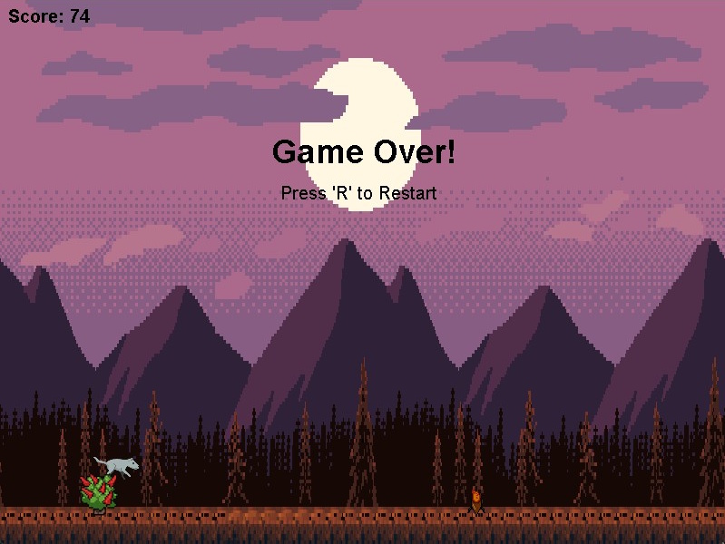

# Java Side Scroller Game

A simple 2D infinite side-scrolling game created in Java using Swing. Jump over obstacles, survive as long as you can, and challenge your high score!

---

## Features
- Classic side-scrolling gameplay
- Randomly generated obstacles
- Increasing difficulty over time
- Sound effects and background music
- Simple controls

---

## Getting Started

### 1. Download and Install Java
- Download the latest [Java JDK](https://adoptopenjdk.net/) (version 17 or later recommended).
- Follow the installation instructions for your operating system.
- Verify installation by running `java -version` in your terminal or command prompt.

### 2. Download and Install an IDE (Optional but Recommended)
- [IntelliJ IDEA Community Edition](https://www.jetbrains.com/idea/download/)
- [Eclipse IDE](https://www.eclipse.org/downloads/)
- [NetBeans](https://netbeans.apache.org/download/index.html)
- [VS Code](https://code.visualstudio.com/) with Java extensions

---

## How to Run

1. **Clone or download this repository.**
2. **Open the project in your favorite IDE.**
3. **Update the pom.xml with your java version**
4. **Build and run the `JavaSideScroller` main class.**
   - In most IDEs, right-click `JavaSideScroller.java` and select `Run`.
   - Or, from the terminal:
     ```sh
     javac -d target/classes src/main/java/com/developertales/sidescroller/*.java
     java -cp target/classes com.developertales.sidescroller.JavaSideScroller
     ```

---

## Controls
- **Space**: Jump
- **R**: Restart after game over
- **ESC**: Exit the game

---

## Screenshot



---

## License
This project is for educational and personal use. Feel free to modify and share!
